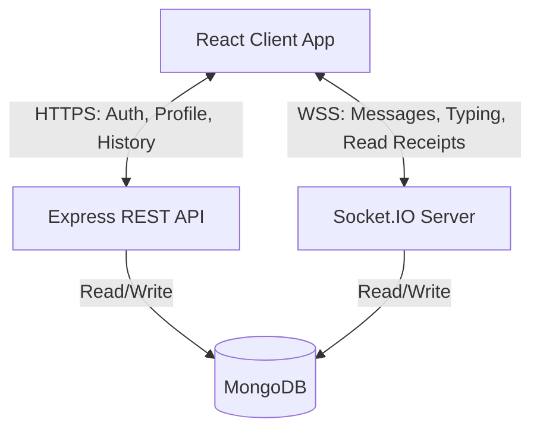
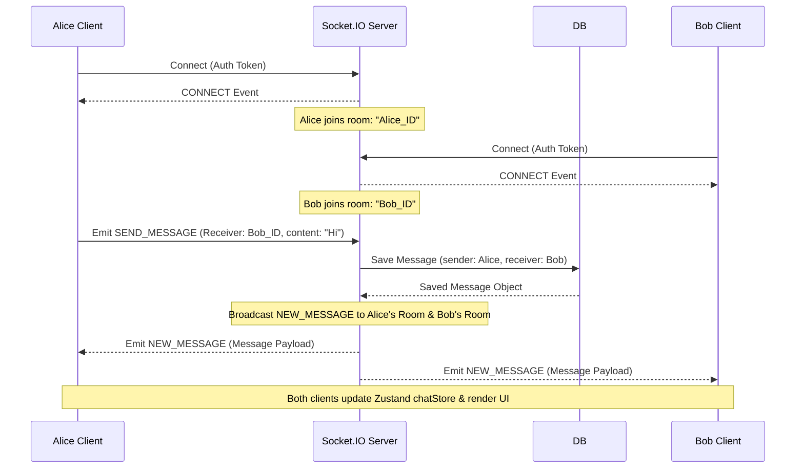
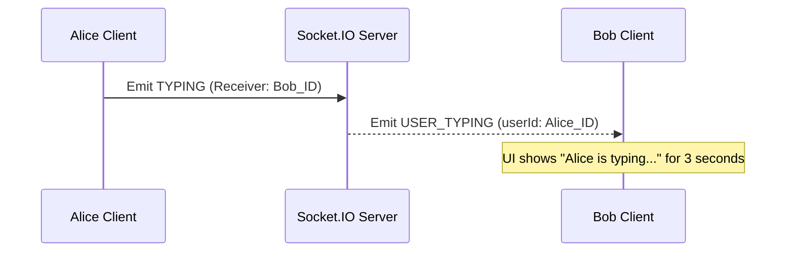

# High-Level Design (HLD) - Messaging Application

## 1. System Overview
The application is a real-time, 1-to-1 direct messaging platform. It utilizes a hybrid approach, using standard RESTful APIs for authentication and profile management, and a persistent WebSocket connection for real-time chat functionality, read receipts, and typing indicators.

## 2. Technology Stack
* **Frontend:** React 19 (Vite), Zustand (State Management), Tailwind CSS v4 (Styling), Socket.IO-Client.
* **Backend:** Node.js, Express, Socket.IO (Real-time engine), TSOA (OpenAPI/Swagger generation and route handling).
* **Database:** MongoDB, TypeORM (MongoDB Driver).

## 3. Architecture Diagram (Logical)

## 4. Key Components

### 4.1 Frontend Application
* **State Management (Zustand):** Zustand is a small, fast, and scalable bear-bones state-management solution using simplified flux principles. It is an alternative to Redux. In this app, it allows us to store the user's session data (`authStore`) and the real-time cache of all messages and typing statuses (`chatStore`) globally, so any React component can instantly access and update the UI without complex prop drilling.
* **Socket Manager (`useSocket`):** A React hook that maintains a singleton connection to the WebSocket server, ensuring robust reconnection handling and event delegation.

### 4.2 Backend Services
* **Controllers (TSOA):** Handle HTTP request validation, routing, and response formatting.
* **Services:** Contain core business logic (e.g., `MessageService`, `AuthService`).
* **Socket Handlers:** Independent module (`chatHandler.ts`) that listens to real-time events, interacts with Services for DB persistence, and orchestrates room-based broadcasting.

### 4.3 Database (MongoDB)
Chosen for its flexibility with document structures (e.g., storing Base64 avatars directly) and rapid read/write capabilities necessary for a chat application.

## 5. Core Data Flows

### 5.1 Real-Time Message Flow (Alice to Bob)

This diagram illustrates a common scenario between two users, Alice and Bob, communicating in real-time. Note how Socket.IO uses "Rooms" (named after user IDs) to securely route messages.

### 5.2 Typing Indicator Flow

### 5.3 Request Traceability
Every HTTP request and Socket event is tagged with a `correlationId`. This ID is passed through the Controller -> Service -> Database layers using a child Logger, allowing full end-to-end tracing of any action in the server logs.
